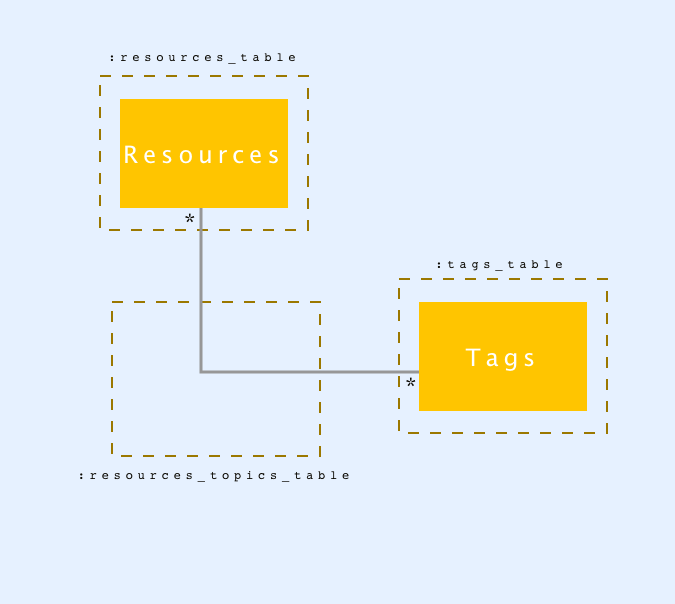

# Mind Map

A tool for researchers built by researchers.

We will gather useful information for researchers from `MediaWiki Action API, News API (a replacement for Google News API)`, `Google Scholar API (Google Search Engine API)`, `GitHub API`...

## Resources

* Search Engine of GitHub

## Elements

* Searches

## Entities

* Resource

## Get Started

* Installation
  * `$ rbenv local 2.7.1`
  * `$ bundle install`
* API Authentication
  * Put your GITHUB_TOKEN into `config/secrets.yml`
* Generate testfile (`spec/fixtures/github_results.yml`)
  * `$ bundle exec ruby spec/fixtures/resource_info.rb`
* Test the Functions & the Code Quality (based on RakeFile)
  * `$ rake spec`
  * `$ rake quality:all`

## Database

We use SQLite as our database for both development and test environments.

The domain resources we save to our database are the following:
* Resource: A GitHub project's details.
* Tags: Tags that provide additional details about something.

### Entity-relationship Diagram

